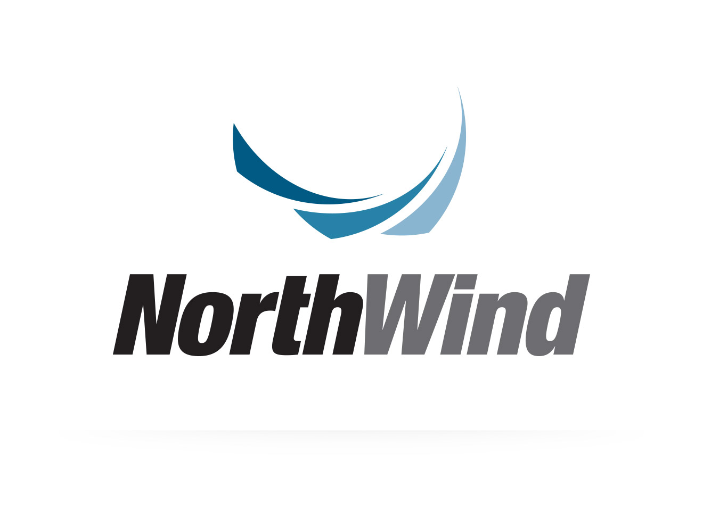
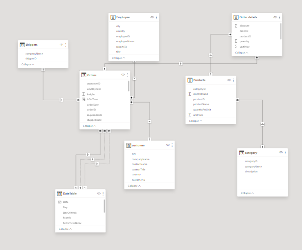

# NORTHWIND-SALES-ANALYSIS

---

## Problem Statement

You have been assigned the role of a BI Developer at Northwind Traders, a global import and export company known for supplying high-quality gourmet food products to restaurants, cafes, and specialty food retailers worldwide. Your primary task is to develop a comprehensive KPI dashboard using any visualization tool of your choice. This dashboard will serve as a vital tool for the executive team to gain a clear and quick understanding of the company's performance across several key areas:

**Sales Trends**: Analyze and display sales data to identify patterns and trends over time.

**Product Performance**: Evaluate the performance of various products to determine best-sellers and underperformers.

**Key Customers**: Highlight significant customers and analyze their purchasing behaviors to strengthen relationships and drive sales.

**Shipping Costs**: Assess shipping expenses to identify cost-saving opportunities and optimize logistics.
The dashboard should be designed to adapt and integrate new data continuously, ensuring its long-term relevance and utility. Additionally, you are encouraged by your manager to generate actionable insights and recommendations to present to the Vice Presidents (VPs), aiding in strategic decision-making.

## Goals

**Develop a Dynamic and Interactive KPI Dashboard**
Create a user-friendly, visually appealing dashboard that allows the executive team to monitor and analyze key performance indicators in real-time.

**Provide Actionable Insights and Recommendations**
Analyze the data to generate meaningful insights and strategic recommendations to help the VPs make informed decisions.

**Ensure Scalability and Adaptability**
Design the dashboard to be flexible and scalable, allowing for easy integration of new data and metrics as the company evolves.
Deliverables

**A Fully Functional KPI Dashboard**
An interactive dashboard that displays sales trends, product performance, key customer analysis, and shipping cost assessment.

**Insights Report**
A detailed report containing data-driven insights and strategic recommendations based on the analysis.

**_Disclaimer_**: All Datasets and reports do not represent any company, country, or institution, but just dummy Datasets to demonstrate the capabilities of Power BI

## _Data Modelling_
Automatically Derived relationships are adjusted to remove and replace unwanted relationships with the required

## Snapshot of Dashboard

# INSIGHTS

## Sales Trends
## _Total Sales and Revenue Insights_

- **Total Sales**: Northwind Traders achieved a total sales revenue of $1.27 million, indicating a strong market presence in the gourmet food industry.

- **Highest Revenue Year**: The peak revenue year was 2014, generating $617,000. This suggests significant market growth or successful sales strategies implemented during that period.

- **Highest Revenue Month**: December 2014 stands out with the highest monthly revenue of $71,000, possibly due to holiday season demand and effective marketing campaigns.

## _Order Volume Analysis_

- **Total Orders**: The company processed a total of 830 orders, reflecting a robust demand for its gourmet food products.

_**Yearly Order Distribution**_:

- **Highest Orders**: In 2014, the company recorded the highest number of orders, totaling 408. This aligns with the highest revenue year, indicating a successful year both in terms of order volume and revenue.
- **Lowest Orders**: The year 2013 had the lowest number of orders, with only 152. This could indicate challenges faced during that year or a lower market demand.

## _Average Order Value (AOV)_

**Overall AOV**: The average order value was $1.53k, providing a benchmark for the typical order size and revenue per transaction.

## _AOV of Top Customers_:
- **Quick Stop**: $3.9k
- **Ernst Handel**: $3.5k
- **Save-a-lot Market**: $3.4k

These top customers significantly exceed the average order value, highlighting their importance to the company’s revenue and suggesting potential for targeted marketing and customer retention strategies.
## _Product Performance_
- **Total Quantity Sold**: The company sold a total of 51,000 units, reflecting strong product demand and successful distribution efforts.

## Year-over-Year (YOY) Growth
_**Total Sales Growth**_:

- **2013 to 2014**: Sales grew by an impressive 197%. This substantial increase can be attributed to several factors, including enhanced marketing strategies, expansion of product lines, a growing customer base, and successful seasonal promotions during peak months.
- **2014 to 2015**: Sales experienced a 29% decline. This drop may be due to market saturation, increased competition, shifts in customer preferences, or broader economic conditions impacting consumer spending.

## _Average Order Value (AOV) Growth_:

- **2013 to 2014**: The average order value rose by 10%, indicating higher spending per order. This growth suggests the successful implementation of upselling and cross-selling strategies.
- **2014 to 2015**: The average order value continued to grow by 8%, reflecting a steady, albeit slower, increase in customer spending.

## _**Total Shipping Cost Growth**_:

**2013 to 2014**: Shipping costs surged by 216%, corresponding with the significant rise in sales and order volumes, potentially due to increased order volumes and extended shipping distances.
**2014 to 2015**: Shipping costs decreased by 32%, possibly resulting from reduced sales volume, improved shipping efficiencies, or renegotiated shipping contracts.

## _Sales by Country_
 **_Top Three Countries by Sales_**

- USA: $246,000
- Germany: $230,000
- Austria: $128,000

**_Bottom Three Countries by Sales_**

- Argentina: $8,100
- Norway: $5,700
- Poland: $3,500

## _Product Performance_
**_Best Selling Products by Category_**

- Beverages: $268,000
- Dairy Products: $235,000
- Confections: $167,000

_**Worst Selling Products by Category**_

- Condiments: $106,050
- Produce: $99,980
- Grains and Cereals: $95,740

## _Top Selling Products_
- **Cote Blaye (Beverages)**: $141,000, indicating a strong customer preference for this beverage.
- **Thuringer Rostbratwurst**: $80,000
- **Raclette Courdavault**: $71,000
- 
## _Top Products by Order Volume_
- **Raclette Courdavault**: 54 orders, reflecting high customer demand.
- **Camembert Pierro**t: 51 orders
- **Gorgonzola Telino**: 51 orders
- **Guarana Fantastica**: 51 orders
- 
## _Customer Insights_
_**Top Customers by Revenue**_

**Quick Stop**: $110,000
**Ernst Handel**: $105,000
**Save-a-lot Market**: $104,000

## _Top Customers by Order Volume_

- Save-a-lot Market: 31 orders
- Ernst Handel: 30 orders
- Quick Stop: 28 orders
- Customer Activity:

**Total Customers**: 91
**Total Active Customers**: 89 (customers who placed orders)
**Inactive Customers**: 2 (customers who did not place any orders)
## _Shipping Costs__
Total Shipping Cost: $64,940

## _Shipping Costs by Company__

- **Highest**: United Package - $28,240, indicating their significant share in handling deliveries.
- **Lowest**: Speedy Express - $16,190
  
## _On-time Delivery Rate_:

- Overall: 96%, demonstrating a high level of efficiency in delivery.
- Highest by Company: Federal Shipping - 96.5%
- Employee Performance
  
## _Top Employees by Orders Attended_

- Margaret Peacock: 156 orders, total sales $230,000. She demonstrated exceptional performance in handling customer orders and generating revenue.
- Janet Leverling: 127 orders, total sales $200,000
- Nancy Davolio: 123 orders, total sales $190,000

#  Strategic Recommendations

## _Product and Sales Strategies_
- **Leverage Top-Selling Products:** Promote and market best-sellers like Cote Blaye and Raclette Courdavault to maximize revenue from these high-demand products.
- **Analyze Sales Surge Factors:** Investigate the strategies and market conditions that led to the 197% sales growth from 2013 to 2014 to replicate and refine these tactics.
- **Address Sales Decline:** Explore the reasons behind the 29% sales decline from 2014 to 2015, using market research to understand changing customer preferences and competitive dynamics.
- **Enhance Customer Spending:** Leverage upselling and cross-selling techniques to maintain and increase the average order value, building on the steady growth observed.
- **Leverage Peak Periods:** Capitalize on trends observed during peak periods, such as December 2014, by implementing similar marketing strategies and promotions to boost sales.
- **Optimize Order Value:** Encourage larger order sizes through bundled deals or discounts on bulk purchases to increase the average order value across all customers.

## _Customer Engagement_
- **Boost Customer Engagement:** Develop targeted marketing strategies to engage top customers such as Quick Stop, Ernst Handel, and Save-a-lot Market. Focus on loyalty programs and personalized offers to increase their order volumes and average order values.

- **Customer Retention Programs:** Implement loyalty programs and personalized marketing campaigns to maintain and potentially increase the high average order values of top customers.

## _Market Focus_
- **Focus on Top Markets:** Prioritize marketing and sales efforts in the USA, Germany, and Austria, as these countries represent the highest revenue opportunities.
- **Revitalize Low-Performing Markets:** Develop targeted strategies to boost sales in Argentina, Norway, and Poland through localized promotions or partnerships.
- **Address Low Order Periods:** Investigate the factors contributing to low order volumes, such as those seen in 2013, and develop strategies to mitigate such declines in the future.

## _Operational Efficiency_
- **Optimize Shipping Costs:** Evaluate shipping costs and explore ways to reduce expenses, such as negotiating better rates with United Package or increasing the use of more cost-effective options like Speedy Express.
- **Maintain High Delivery Efficiency:** Uphold the high on-time delivery rate by monitoring and improving logistics processes to ensure customer satisfaction and loyalty.

## _Employee Performance_
- **Enhance Employee Performance:** Recognize and reward top-performing employees like Margaret Peacock, Janet Leverling, and Nancy Davolio to motivate continued excellence and improve overall sales performance.

## _Continuous Improvement_
- **Continuous Monitoring:** Regularly update and analyze sales data to identify emerging trends and adjust strategies accordingly, ensuring sustained growth and market competitiveness.

## Summary Conclusion

By integrating these strategic recommendations, Northwind Traders can optimize product and sales strategies, enhance customer engagement, focus on key markets, improve operational efficiency, and foster continuous improvement. These comprehensive actions will help ensure sustained growth, market competitiveness, and overall success in the gourmet food industry.

